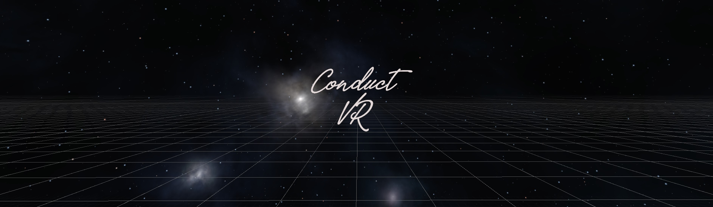

<section id="about-content" class="py-24">
  

    

      
    

    

      <h2 class="text-3xl tracking-tight mb-6 uppercase font-bold text-white" style="letter-spacing: 0.1em;">About Me</h2>
      

        
I'm a musician, technology enthusiast, and student from Colorado. Classically trained and a jazz lover at heart, I play trumpet and sing, but my passion lies in interdisciplinary creation. I love finding ways to understand music through the lens of other disciplines, from engineering to computer science. This has led me to explore mixed reality and its applications in the arts, with the goal of transforming education and live performance.

        
With a degree in music, I see this work as the natural culmination of my parents' legacy. My mother, a lifelong music lover, was an English teacher in the Denver Public Schools, and my father worked in IT. Their combined passions for education, the arts, and technology are the foundation upon which I build. I'm always looking to collaborate and expand my musical, educational, and professional boundaries.

      

    

  

</section>